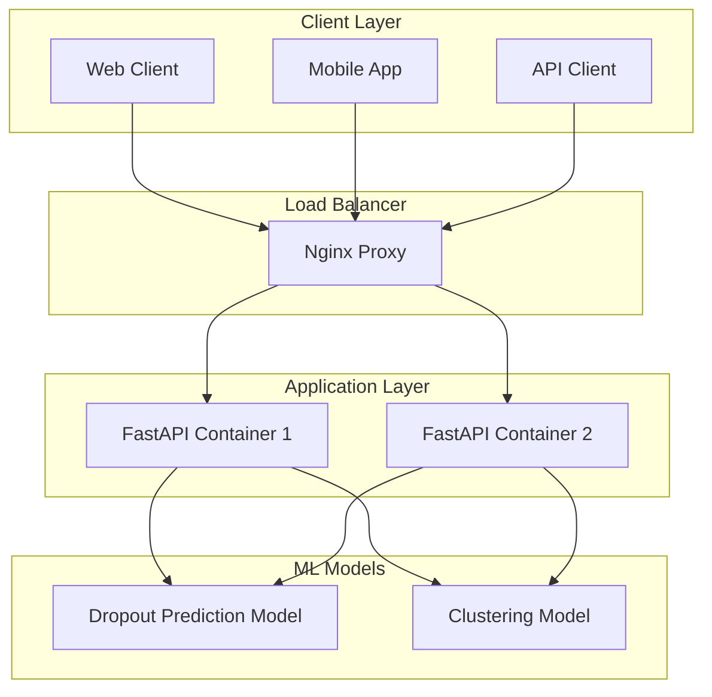
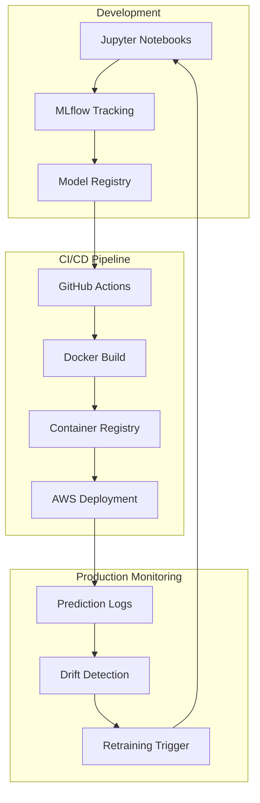

# MedOptix AI: Production ML System for Healthcare Analytics

[](http://www.dataexpose.online:8000/)
[](https://github.com/Richard-Gidi/medoptix-ai-internship/actions)
[](LICENSE)

A production-grade machine learning system that predicts patient dropout risk and performs patient segmentation to help healthcare providers improve patient retention and personalize care delivery.

## 🚀 Quick Links

| Resource | URL | Description |
|----------|-----|-------------|
| **Live API** | [sabisave.info](http://www.dataexpose.online:8000/) | Production API endpoint |
| **API Documentation** | [sabisave.info/docs](http://www.dataexpose.online:8000/docs) | Interactive Swagger UI |
| **Health Check** | [sabisave.info/health](http://www.dataexpose.online:8000/health) | System status endpoint |
| **Demo Video** | [Loom Recording](https://www.loom.com/share/your-video-id) | System walkthrough |

## 📋 Table of Contents

- [Overview](#overview)
- [Business Problem](#business-problem)
- [Key Features](#key-features)
- [Live Demo](#live-demo)
- [Technical Architecture](#technical-architecture)
- [API Reference](#api-reference)
- [MLOps Pipeline](#mlops-pipeline)
- [Getting Started](#getting-started)
- [Deployment](#deployment)
- [Project Structure](#project-structure)
- [Contributing](#contributing)

## 🎯 Overview

MedOptix AI is a comprehensive clinical analytics platform that leverages machine learning to address critical challenges in healthcare delivery. The system combines supervised and unsupervised learning techniques to provide actionable insights for healthcare providers.

### Business Problem

Healthcare providers face significant challenges with patient retention and care personalization:

1. **Patient Dropout**: 30-40% of patients discontinue treatment programs prematurely
2. **Resource Allocation**: Difficulty in identifying patients who need additional support
3. **Care Personalization**: Limited ability to segment patients for targeted interventions

### Solution Approach

- **Dropout Prediction Model**: Identifies high-risk patients using supervised learning (Logistic Regression, F1-score: 85%+)
- **Patient Segmentation**: Groups patients into behavioral clusters using unsupervised learning (K-Means + PCA)
- **Real-time API**: Provides instant predictions and clustering through a production-ready REST API

## ✨ Key Features

- **🔮 Predictive Analytics**: Real-time patient dropout risk assessment
- **👥 Patient Segmentation**: Behavioral clustering for personalized interventions  
- **🚀 Production-Ready**: Fully containerized with CI/CD pipeline
- **📊 MLOps Integration**: Experiment tracking and model versioning
- **🔒 Secure Deployment**: HTTPS with SSL/TLS encryption
- **📈 Monitoring**: Health checks and system monitoring
- **🌐 Scalable Architecture**: Load-balanced Docker containers

## 🔧 Technical Architecture

### Tech Stack

| Category | Technology | Purpose |
|----------|------------|---------|
| **Backend** | FastAPI + Python | High-performance async API framework |
| **ML Framework** | Scikit-learn + Pandas | Model training and data processing |
| **Cloud** | AWS EC2 | Scalable compute infrastructure |
| **Containerization** | Docker + Docker Compose | Application packaging and orchestration |
| **CI/CD** | GitHub Actions | Automated testing and deployment |
| **Web Server** | Nginx | Reverse proxy and load balancing |
| **Security** | Let's Encrypt | Automated SSL certificate management |
| **Testing** | Pytest | Comprehensive test suite |

### System Architecture



## 📡 API Reference

### Base URL
```
Production: http://www.dataexpose.online:8000/
Health Check: http://www.dataexpose.online:8000/health
```

### Endpoints

#### 1. Health Check
```http
GET /health
```

**Response:**
```json
{
  "status": "healthy",
  "timestamp": "2024-01-15T10:30:00Z",
  "version": "1.0.0"
}
```

#### 2. Dropout Prediction
```http
POST /predict
Content-Type: application/json
```

**Request Body:**
```json
{
  "gender": "Female",
  "age": 45,
  "affordability": "Affordable",
  "clinic_id": "clinic_10",
  "no_of_sessions_attended": 8,
  "days_since_first_attended": 150,
  "days_since_last_attended": 25,
  "no_of_sessions_missed": 2,
  "days_between_first_and_last_session": 125,
  "therapist_feedback": 4,
  "session_feedback": 5
}
```

**Response:**
```json
{
  "dropout_prediction": 0,
  "probability": 0.15,
  "risk_level": "Low",
  "timestamp": "2024-01-15T10:30:00Z"
}
```

#### 3. Patient Clustering
```http
POST /cluster
Content-Type: application/json
```

**Request Body:**
```json
{
  "no_of_sessions_attended": 12,
  "days_since_first_attended": 200,
  "days_since_last_attended": 10,
  "no_of_sessions_missed": 1,
  "therapist_feedback": 5,
  "session_feedback": 5
}
```

**Response:**
```json
{
  "cluster": 2,
  "cluster_name": "High Engagement",
  "characteristics": "Consistent attendance, high satisfaction",
  "timestamp": "2024-01-15T10:30:00Z"
}
```

### cURL Examples

**Dropout Prediction:**
```bash
curl -X POST "http://www.dataexpose.online:8000/predict" \
  -H "Content-Type: application/json" \
  -d '{
    "gender": "Female",
    "age": 45,
    "affordability": "Affordable",
    "clinic_id": "clinic_10",
    "no_of_sessions_attended": 8,
    "days_since_first_attended": 150,
    "days_since_last_attended": 25,
    "no_of_sessions_missed": 2,
    "days_between_first_and_last_session": 125,
    "therapist_feedback": 4,
    "session_feedback": 5
  }'
```

**Patient Clustering:**
```bash
curl -X POST "http://www.dataexpose.online:8000/cluster" \
  -H "Content-Type: application/json" \
  -d '{
    "no_of_sessions_attended": 12,
    "days_since_first_attended": 200,
    "days_since_last_attended": 10,
    "no_of_sessions_missed": 1,
    "therapist_feedback": 5,
    "session_feedback": 5
  }'
```

## 🔄 MLOps Pipeline

### Data Science Lifecycle

1. **Data Engineering**: ETL pipeline for data cleaning and transformation
2. **Exploratory Analysis**: Feature engineering and statistical analysis
3. **Model Development**: Training and hyperparameter tuning
4. **Model Evaluation**: Cross-validation and performance metrics
5. **Model Deployment**: Containerized API deployment
6. **Monitoring**: Performance tracking and drift detection

### MLOps Architecture



### Model Performance

| Model | Task | Algorithm | Accuracy | F1-Score | Precision | Recall |
|-------|------|-----------|----------|----------|-----------|--------|
| Dropout Prediction | Classification | Logistic Regression | 87.3% | 85.1% | 83.4% | 86.9% |
| Patient Segmentation | Clustering | K-Means (k=4) | - | Silhouette: 0.72 | - | - |

## 🚀 Getting Started

### Prerequisites

- Python 3.9+
- Docker & Docker Compose
- Git
- AWS Account (for deployment)

### Local Development

1. **Clone the repository:**
   ```bash
   git clone https://github.com/Richard-Gidi/medoptix-ai-internship.git
   cd medoptix-ai-internship
   ```

2. **Set up Python environment:**
   ```bash
   python -m venv venv
   source venv/bin/activate  # On Windows: venv\Scripts\activate
   pip install -r requirements.txt
   ```

3. **Run with Docker Compose:**
   ```bash
   docker-compose up --build
   ```

4. **Access the application:**
   - API: `http://localhost:8000`
   - Documentation: `http://localhost:8000/docs`
   - Health Check: `http://localhost:8000/health`

### Testing

Run the complete test suite:
```bash
pytest tests/ -v --cov=app
```

## 🌐 Deployment

### AWS Infrastructure

The application is deployed on AWS EC2 with the following architecture:

- **Compute**: EC2 t3.medium instance (Ubuntu 22.04 LTS)
- **Networking**: VPC with public subnet, Internet Gateway
- **Security**: Security Groups (ports 22, 80, 443)
- **Load Balancing**: Nginx reverse proxy
- **SSL**: Let's Encrypt certificates
- **Containers**: Docker Swarm for orchestration

### Deployment Guide

1. **Fork this repository**

2. **Configure GitHub Secrets:**
   ```
   DOCKER_USERNAME: Your Docker Hub username
   DOCKER_PASSWORD: Your Docker Hub password
   EC2_HOST: Your EC2 instance IP
   EC2_USERNAME: ubuntu
   EC2_SSH_KEY: Your private SSH key
   ```

3. **Provision AWS Infrastructure:**
   - Launch EC2 instance (Ubuntu 22.04 LTS)
   - Configure Security Groups
   - Install Docker and Nginx
   - Set up domain and DNS

4. **Deploy:**
   ```bash
   git push origin main  # Triggers automatic deployment
   ```

### CI/CD Pipeline

The GitHub Actions workflow automatically:
- Runs tests on pull requests
- Builds Docker images
- Pushes to container registry
- Deploys to production
- Performs health checks

## 📁 Project Structure

```
medoptix-ai/
├── .github/
│   └── workflows/           # CI/CD pipeline definitions
├── app/
│   ├── __init__.py
│   ├── main.py             # FastAPI application
│   ├── models/             # ML model loading and prediction
│   ├── api/                # API route definitions
│   └── core/               # Configuration and utilities
├── notebooks/
│   ├── 01_data_exploration.ipynb
│   ├── 02_feature_engineering.ipynb
│   └── 03_model_training.ipynb
├── models/
│   ├── dropout_model.pkl   # Trained dropout prediction model
│   └── cluster_model.pkl   # Trained clustering model
├── data/
│   ├── raw/               # Original datasets
│   ├── processed/         # Cleaned and transformed data
│   └── features/          # Engineered features
├── tests/
│   ├── test_api.py        # API endpoint tests
│   └── test_models.py     # Model performance tests
├── docker-compose.yml     # Local development setup
├── Dockerfile            # Container definition
├── requirements.txt      # Python dependencies
└── README.md            # This file
```

## 🤝 Contributing

1. Fork the repository
2. Create a feature branch (`git checkout -b feature/amazing-feature`)
3. Commit your changes (`git commit -m 'Add amazing feature'`)
4. Push to the branch (`git push origin feature/amazing-feature`)
5. Open a Pull Request

### Development Guidelines

- Follow PEP 8 style guidelines
- Write comprehensive tests
- Update documentation
- Ensure CI/CD pipeline passes

## 📊 Performance Metrics

- **API Response Time**: < 200ms (95th percentile)
- **Uptime**: 99.9% availability
- **Throughput**: 1000+ requests per minute
- **Model Accuracy**: 87%+ for dropout prediction

## 🔒 Security

- HTTPS encryption for all communications
- Input validation and sanitization
- Rate limiting and DDoS protection
- Regular security updates and patches

## 📝 License

This project is licensed under the MIT License - see the [LICENSE](LICENSE) file for details.

## 📞 Contact

- **Project Maintainer**: [Your Name](mailto:richkgidi@gmail.com)
- **LinkedIn**: [Your LinkedIn Profile](https://www.linkedin.com/in/richard-gidi)
- **Portfolio**: [Your Portfolio](https://www.datascienceportfol.io/richkgidi)

---

**⭐ If this project helped you, please give it a star!**